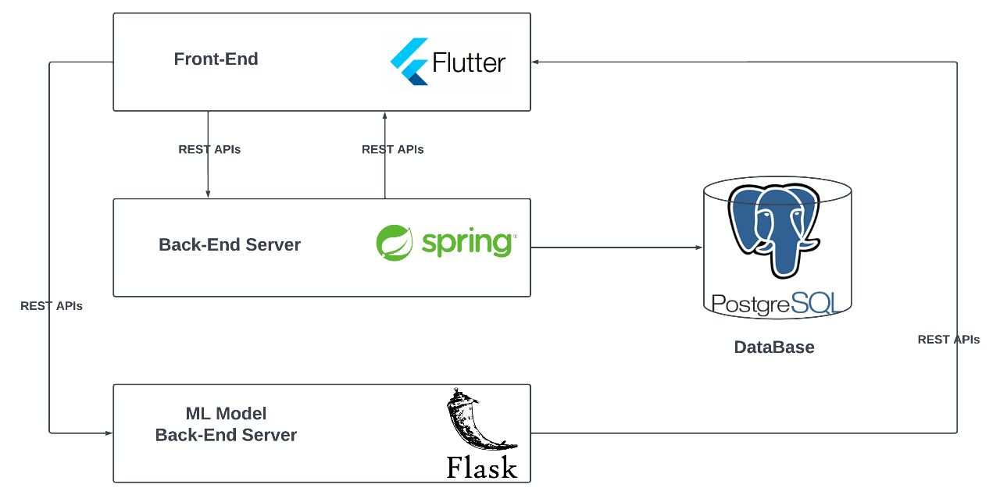

# Plant Gurad 
  This is our graduation project for the Bachelor's degree in computer science from Cairo University, Faculty of Computer and Artificial Intelligence.

# Motivation and Problem
  - Agriculture has been a crucial sector of the Egyptian economy for thousands of years, and it remains an essential part of the country's economic and social fabric today. Here are some of the key reasons why agriculture is important in Egypt:
       1.	Food security: Egypt's population is large and growing, and agriculture is critical to ensuring that the country can feed its people. The sector provides a significant portion of the country's food supply, including staples such as wheat, rice, and maize.
       2.	Employment: Agriculture is a significant source of employment in Egypt, particularly in rural areas. The sector provides jobs for millions of people, including farmers, farm laborers, and workers in related industries such as food processing and transportation.
       3.	Economy: Agriculture is a significant component of the Egyptian economy, contributing 11.3 percent of the country's gross domestic product. The agricultural sector accounts for 28 percent of all jobs, and over 55 percent of employment in Upper Egypt is agriculture-related according to USAID.
       4.	Export earnings: Egypt is a significant exporter of agricultural products, including fruits, vegetables, and cotton. These exports generate important foreign exchange earnings for the country, helping to support its economy.

# Our Solution
  - our objective is to help farmers by early disease detection and not fully rely on agricultural guides by:
       1. Detect plant diseases from images and videos with a high degree of accuracy.
       2. Classify the detected diseases into specific categories based on their symptoms.
       3. Provide farmers with information about the severity of the disease.
       4. Provide them with a Video analysis session that let them know how much-diseased plants are in their population.
       5. Provide them with a history that allows them to check the analysis in the last session.
       6. Provide a cost-effective solution that can be deployed in a variety of settings, including small-scale farms and large commercial operations.
  - The ultimate goal of this project is to help farmers identify and manage plant diseases more effectively, leading to increased crop yields, reduced losses, and improved food security.
# Platform Features
  - The app allows farmers to do the following:
       1. Sign up and log in to the system
       2. Add a new farm  
       3. Show all farms
       4. Analyze a specific farm and show its history to keep track  
       5. Take an image to detect if there are diseases or not. 
       6. Upload an image to detect if there are diseases or not.
       7. Perform real-time detection to check a large part of the farm if needed.
# Project Structure
  
# Back-End
  Used Java and Spring Boot for building the back-end server using Spring Data and Spring REST to allow communication with the front-end
# Front-End
  Built-in Flutter and communicates with the back-end using RESTful APIs.
# Database
  The database used is PostgreSQL and the database schema is generated using Spring Data model entities
  
# This project was created by software engineers :

### Marwan Mostafa
- [GitHub](https://github.com/MarwanaMostafa)
- [LinkedIn](https://www.linkedin.com/in/marwan-mostafa-4651a61b3/)

### Nada Emad
- [GitHub](https://github.com/NadaaEmad)
- [LinkedIn](https://www.linkedin.com/in/nada-emad-33370b20b/)

### Mazen Ahmed 
- [GitHub](https://github.com/Mazenelshereef)
- [LinkedIn](https://www.linkedin.com/in/mazenelshereef/)

### Zeyad Ahmed
- [GitHub](https://github.com/Ze-Ro0o)
- [LinkedIn](https://www.linkedin.com/in/zeyad-ahmed-b81a83235/)

### Omar Awad
- [GitHub](https://github.com/omarawd7)
- [LinkedIn](https://www.linkedin.com/in/omar-awad-bb9ab4211/)
### Under the supervision of Prof. Ahmed Shawky Moussa, Cairo University, Faculty of Computer and Artificial Intelligence., Computer Science department.

